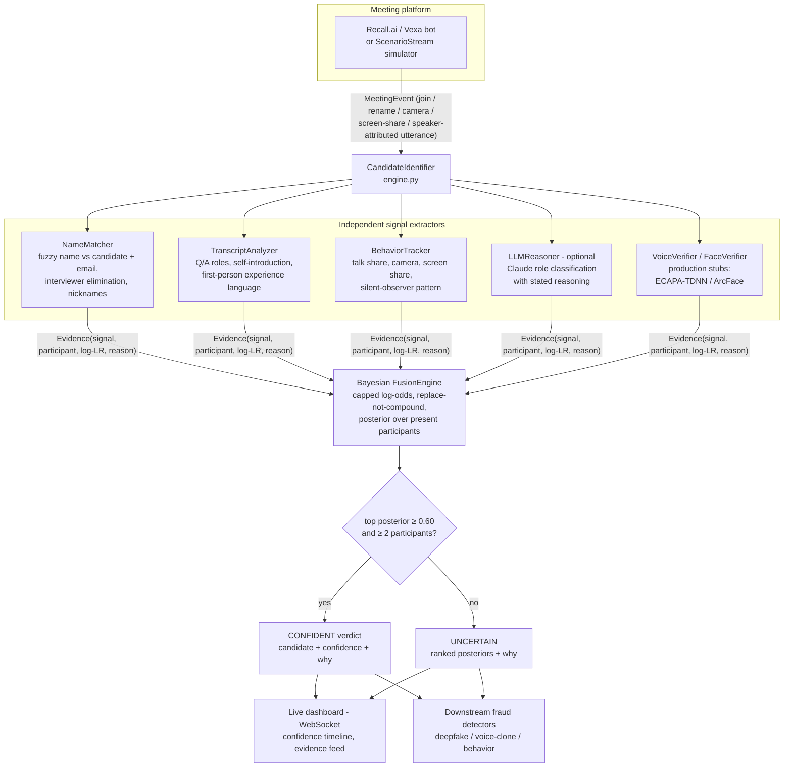

# Sherlock — Real-Time Interview Candidate Identification

A working prototype that automatically identifies **which meeting participant is the interview candidate**, continuously, with a calibrated confidence score and a human-readable explanation — even when display names lie ("MacBook Pro"), the ATS has the wrong name, people rename themselves mid-call, or silent observers join.

Built for the Sherlock Internship Challenge.

---

## The core idea

No single signal is reliable:

| Signal | Fails when… |
|---|---|
| Display name | Candidate joins as "MacBook Pro", nickname, renames mid-call |
| ATS candidate name | Recruiter typo'd it |
| Talk time | Chatty interviewer, panel formats |
| Self-introduction | Candidate never says their full name |

So instead of rules, the system runs **independent signal extractors feeding a Bayesian fusion engine**. Each extractor emits *evidence* — a log-likelihood ratio for a participant. The fusion engine maintains a posterior over "who is the candidate" and updates it on every meeting event:

```
posterior(p) ∝ prior(p) × exp( Σ log_lr(signal, p) )
```

Key design decisions:

1. **Evidence replaces, never compounds.** Evidence is keyed by `(signal, participant)`. Continuous signals (talk share, camera state) refresh their value on every event instead of stacking, so the posterior can't be inflated by repetition.
2. **Per-signal caps.** No single extractor can contribute more than ±3.0 log-odds, so no one signal can saturate the verdict — the "multiple weak signals" property is enforced by construction.
3. **Abstention is a first-class output.** Below the confidence threshold (default 0.60), the verdict is `uncertain` with the current ranking — never a guess. A wrong candidate ID would poison every downstream fraud detector; abstaining is the safe failure mode.
4. **Identity is the platform participant ID, never the display name.** A mid-call rename cannot transfer or reset accumulated evidence — and the rename itself is flagged as a fraud-relevant signal.
5. **Fraud flags are separate from identification.** Zero-weight `*_flag` evidence (mid-call rename, multiple voices in one audio stream) never moves the posterior but is surfaced to downstream fraud detectors — identifying *who* the candidate is and flagging *whether something is off* are deliberately decoupled.
6. **The LLM is one voice, not the judge.** The Claude-based role reasoner emits evidence into the same fusion engine as everything else, bounded like every other signal. The system stays fully functional (and passes all tests) with the LLM disabled.

## Architecture



The engine consumes a platform-agnostic `MeetingEvent` stream. The demo replays JSON scenarios through `ScenarioStream`; a production deployment swaps in a meeting-bot adapter ([Recall.ai](https://www.recall.ai/) or self-hosted [Vexa](https://vexa.ai/) already provide per-participant streams, join/leave/rename events, and speaker-attributed transcripts for Meet/Teams/Zoom). **That adapter is the only integration point** — nothing else changes.

## Signals implemented

| Extractor | Signal | Evidence examples |
|---|---|---|
| `NameMatcher` | display name vs candidate name, email local-part, nickname dictionary, interviewer names from the calendar | strong match **+2.2** · matches interviewer **−2.5** · device name ("MacBook Pro") **0.0** (deliberately *not* negative — candidates often join that way) |
| `TranscriptAnalyzer` | self-introduction ("I'm Sagar") vs real candidate name; question/answer structure; first-person experience language | self-intro matches candidate **+2.5** · repeatedly asks questions **−1.2** · long answers after questions **+0.5…+1.5** |
| `BehaviorTracker` | talk share, camera on/off, screen sharing, silence | dominant talk share **+1.2** · screen share **+1.5** · silent camera-off (observer) **−1.2/−0.8** |
| `DiarizationAnalyzer` | diarization outputs per participant stream: enrollment voice match, attribution cross-check, speaker count (simulated payloads in the demo; pyannote/ECAPA-TDNN in production) | voice matches enrollment **+2.0** · diverged from enrollment **−1.0** · acoustic diarization disagrees with platform attribution **−1.5** · **2+ voices in one stream → zero-weight fraud flag** (proxy/whisperer) |
| `LLMReasoner` | Claude (`claude-opus-4-8`, structured output) classifies conversational roles over a sliding transcript window | calibrated probability → bounded log-odds, with a one-sentence stated reason per participant |
| `VoiceVerifier` / `FaceVerifier` | production stubs (see Roadmap) | — |

## Quick start

```bash
git clone https://github.com/bizzlemuffinn/sherlock-candidate-id
cd sherlock-candidate-id
pip install -r requirements.txt

# CLI demo — replay all six scenarios, deterministic signals only
python run_demo.py --all --no-llm

# with the Claude LLM reasoner (optional)
export ANTHROPIC_API_KEY=sk-ant-...
python run_demo.py scenarios/02_macbook_pro.json

# live dashboard — watch confidence evolve in real time
python server.py --speed 10        # then open http://localhost:8000

# tests
python -m pytest tests/ -v
```

The engine itself has **zero dependencies** (pure standard library). `fastapi`/`uvicorn` are only for the dashboard, `anthropic` only for the optional LLM reasoner.

## Scenarios (the brief's edge cases, verbatim)

| Scenario | Edge case | Expected outcome |
|---|---|---|
| `01_happy_path` | clean baseline | candidate, high confidence |
| `02_macbook_pro` | candidate joins as **"MacBook Pro"** | identified from self-intro + Q/A structure |
| `03_rename_and_observers` | joins as "SP", **renames mid-call** to nickname "Sam"; **two silent observers**; **two interviewers** | identified; rename flagged; evidence survives rename |
| `04_wrong_ats_name` | **recruiter entered the wrong candidate name** — name and self-intro signals both fail | identified purely from behavior + role elimination |
| `05_ambiguous_early` | 2 minutes in, generic names, no real speech | **UNCERTAIN** — abstains instead of guessing |
| `06_proxy_speaker` | mid-interview, diarization finds a **second voice** in the candidate's stream and the voice drifts from the enrollment sample | candidate still identified; **fraud flags fire** with zero posterior weight |

Each scenario JSON encodes its expected outcome; `run_demo.py --all` and the test suite check them automatically.

## Evaluation

**How it was tested**
- 6 scripted scenarios targeting each edge case in the brief (plus a proxy-speaker fraud case), run as parametrized pytest cases — the engine must pass **without** the LLM (deterministic floor), and the LLM only adds evidence on top.
- Unit tests for fusion invariants: rename does not reset identity, leaving removes a participant from the hypothesis space, confidence grows monotonically with evidence in the happy path, single-participant meetings are never "confident".
- Fuzzy name matcher tested against nicknames ("Bill"/"William"), email local-parts, device names.

**Results:** 6/6 scenarios correct, 11/11 tests green, end-to-end WebSocket replay verified. In scenarios 1–4 the correct participant exceeds the 0.60 threshold within the first two Q/A exchanges (~2–3 minutes of meeting time) and converges to >0.95.

**Known limitations**
- Log-LR weights are hand-set from priors, not learned. Fix: log every interview's final signal vector + confirmed label, periodically refit a logistic regression over signal weights — the system then *learns from data* with no architecture change.
- Transcript heuristics are English-centric regexes; the LLM reasoner covers other languages but costs latency/money.
- Scenarios are scripted, not recorded meetings; real transcripts are noisier (ASR errors, crosstalk). The per-signal caps and fusion are designed to degrade gracefully, but this is unproven on production audio.
- Voice/face verification are stubs — exactly the signals that would catch a proxy-interview fraud where all conversational signals look legitimate.
- Adversarial candidates who know the system (e.g. deliberately asking many questions) could suppress their own score; multi-modal signals (voice/face) are the countermeasure.

## Trade-offs

- **Bayesian fusion vs end-to-end ML classifier** — fusion is explainable by construction (every verdict decomposes into named evidence), needs zero training data, and lets weak signals fail independently. An ML classifier would score better *after* thousands of labeled interviews exist — the logging hook is in place for that migration.
- **LLM as evidence source vs LLM as final judge** — judge would be simpler and probably more accurate on transcripts, but adds latency and cost to every decision, can't run air-gapped, and fails unpredictably. As one bounded voice, its failures are contained.
- **Simulator-first demo vs live meeting-bot integration** — the bot integration is commodity plumbing (Recall.ai is a paid API); the interesting problem is the reasoning. The `MeetingEvent` abstraction means the plumbing bolts on later without touching the engine.

## What I'd improve next

1. **Live meeting-bot adapter** — Recall.ai (or self-hosted Vexa) → `MeetingEvent`, joining real Meet/Teams/Zoom calls.
2. **Voice verification** — ECAPA-TDNN embeddings (SpeechBrain) per participant stream vs an enrollment sample from the phone screen; embedding drift also detects mid-interview candidate swaps.
3. **Face verification + active-speaker detection** — ArcFace/InsightFace vs ATS profile photo; TalkNet-style lip-sync to bind the on-camera face to the speaking voice (feeds Sherlock's deepfake detection directly).
4. **Learned fusion weights** — logistic regression over logged signal vectors, replacing hand-set log-LRs; per-format priors (panel vs 1:1 vs HR screen).
5. **Calibration monitoring** — reliability diagrams so 0.8 confidence *means* 80% correct.

## Assumptions

- The platform provides stable participant IDs, join/leave/rename events, and a speaker-attributed transcript (true of Meet/Teams/Zoom via bot APIs like Recall.ai/Vexa).
- Interview metadata (candidate name/email, interviewer names) is available but **untrusted** — every scenario except the baseline has some of it wrong.
- One candidate per meeting (the dominant interview format). Multi-candidate group interviews would need a multi-label hypothesis space — the fusion engine's categorical model is the only piece that changes.
- Utterance timestamps/durations come from the platform's speaking-activity events.

## Repo layout

```
sherlock_id/
  models.py          # MeetingEvent, Participant, Evidence, Verdict
  stream.py          # event-stream abstraction + scenario loader
  fusion.py          # Bayesian log-odds fusion, abstention logic
  engine.py          # orchestrator (state -> extractors -> fusion)
  extractors/
    name_matcher.py  # fuzzy names, nicknames, interviewer elimination
    transcript.py    # Q/A roles, self-introduction
    behavior.py      # talk share, camera, screen share
    diarization.py   # voice enrollment match, attribution check, proxy flag
    llm_reasoner.py  # Claude structured-output role classifier (optional)
    stubs.py         # voice/face verification interfaces
scenarios/           # 6 edge-case scenario JSONs (self-checking)
tests/               # pytest suite (runs without the LLM)
run_demo.py          # CLI replay with confidence timeline + explanation
server.py            # FastAPI + WebSocket live dashboard
dashboard/index.html # zero-dependency live UI
```
